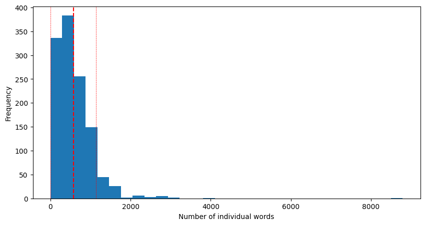
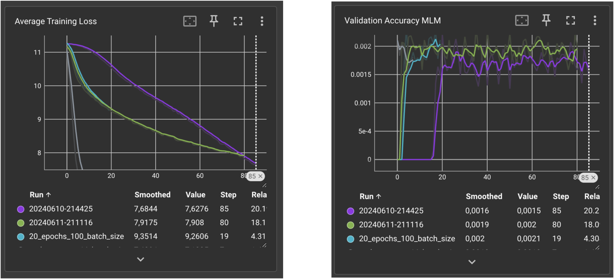

# fairyTaleAI

# Abstract

# How to run it?
In the next sections we show how to run the training and the inference, for both custom BERT and transfer learning BERT. In addition we show how to run the ui.

- General setup
    - Create virtual environment
    - `pip install -r requirements.txt`
- Resources used to train and inference
    - 💻 Macbook Pro M3 Pro
    - 📊 Milvus database
    - ☁️ Zilliz cloud to manage vector database

## How to run custom BERT training
In order to run the training routing for custom BERT you should run the following file: `custom_model_train_main.py` inside the training folder.

## How to run transfer learning training
In order to run the training routing for transfer learning BERT you should run the following file: `main_transfer_learning.py` inside the training folder.

## How to run custom BERT inference
In order to perform an inference to custom BERT you should run the following file: `create_embedding_DB.py` inside the inference folder.
Inside the file you can type your prompt to perform the inference.

## How to run transfer learning training
In order to perform an inference to custom BERT you should run the following file: `createTL_embedding_DB.py` inside the inference folder.
Inside the file you can type your prompt to perform the inference.

## How to run UI
To run the UI you should run on the terminal the following command: `streamlit run inference/ui_app.py` from the root of the project.
To be able to run the inference with Llama 3 in local you should install [Ollama](https://ollama.com/download) and download the model with 
`ollama run llama3`.
If you want to perform inference with the non local models (GPT-3.5 Turbo or Claude 3.5) You should add the specific api key for each of them in the file `API_secrets.py`.

# Table of Contents

[**3. Introduction**](#Introduction)

- [3.1 Background & Motivation](#Background-and-motivation)
- [3.2 Objectives & Scope](#Objectives-and-scope)

[**4. Methodology**](#Methodology)

- [4.1 Data Collection](#Data-Collection)
- [4.2 Tokenizer](#Tokenizer)
- [4.3 Model Architecture](#Model-Architecture)
- [4.4 Training Routine](#Training-Routine)
- [4.5 Embedding Generation](#Embedding-Generation)
- [4.6 Vector DB](#Vector-DB)
- [4.7 Large Language Model](#LLM)
- [4.8 Prompting](#Prompting)
- [4.9 UI](#UI)


[**5. Experiments & Results**](#Experiments-&-Results)

- [5.1 TensorBoard](#Tensorboard-for-metric-follow-up)
- [5.2 Custom BERT and challenges](#Custom-BERT-model-and-challenges)
- [5.3 Transfer Learning](#Dataset-Issues-and-Transfer-Learning)
- [5.4 Embedding representation results](#Embedding-representation-results)

[**6. Conclusions**](#Conclusions-and-further-exploration)


# 3. Introduction

## 3.1 Background and motivation

Natural Language Processing (NLP) has come a long way with models like BERT, which help computers understand and generate human language more effectively. This progress opens up exciting possibilities for creating engaging and contextually rich stories.

The idea for this project started from a personal experience within our team. One of us had a nephew who asked for a bedtime story about "pirates in space." As Catalans who value storytelling but aren't all naturally imaginative, we struggled. Attempts to use existing generative models resulted in stories that missed the context and creativity the child wanted. This frustration highlighted a gap in current story generation tools.

Motivated by this experience, we set out to create a better way to generate fairy tales that truly capture the magic and context of the themes kids ask for. We decided to train a BERT model specifically for this purpose and use a Retrieval-Augmented Generation (RAG) system. This way, when someone requests a story, the system can understand the request, find similar tales, and generate a new, engaging story.

Our goal is to provide a tool that can make storytelling easier and more fun, ensuring that every story is as imaginative and contextually rich as the ones we cherish from our childhood.

## 3.2 Objectives and scope

### Objectives

The primary objective of this project is to develop an advanced story generation system that can create contextually rich and engaging fairy tales based on user input. 

In order to achieve this, we would divide our project into 3 different phases:


These 3 phases have been further divided into more specific tasks:

**Create a Custom Tokenizer**:

- Develop a tokenizer specifically designed for our dataset of fairy tales to ensure accurate text processing.
  
**Train a BERT Model**: 

- Train a BERT model using the custom tokenizer and a diverse dataset of fairy tales to enable it to understand and generate narrative content effectively.

**Implement a RAG System**: 
- Develop a system that integrates a vector database for storing embeddings of fairy tales and uses these embeddings to enhance the story generation process.

**Generate Rich Fairy Tales**: 
- Use the embeddings retrieved from our database as context for an LLM to generate a more rich and engaging version of a fairy tale.

**Evaluate the System**: 
- Assess the performance of the system through qualitative and quantitative metrics to ensure it meets the desired objectives.

### Scope

The scope of this project encompasses the following key areas:


**Data Collection and Preprocessing:**

- Collect a dataset of fairy tales for training the BERT model.
- Preprocess the dataset to ensure it is suitable for training.

**Tokenizer Development:**

- Create a custom tokenizer tailored to the fairy tale dataset.

**Model Training and Development:**

- Train the BERT model on the collected dataset. We will do this by implementing:
  - **MLM (Masked Language Model)**
  - **NSP (Next Sentence Prediction)** tasks to fine-tune the model for narrative generation.

**Embedding and Vector Database:**

- Create embeddings of the fairy tales using the trained BERT model.
- Store these embeddings in a vector database to facilitate efficient retrieval.

**Retrieval-Augmented Generation System:**

- Develop the retrieval mechanism using cosine similarity to find relevant story contexts.
- Integrate the retrieval system with a language model to generate new stories based on user input.

**System Evaluation:**

- Conduct experiments to evaluate the retrieval accuracy and the quality of the generated stories.

**User Interface:**

- Design a user-friendly interface where users can input their story requests and receive generated stories.

# 4. Methodology

### Data Collection

**Data Gathering**

To develop an advanced story generation system, we needed a robust and diverse dataset of fairy tales. Our data collection process involved multiple sources to ensure a comprehensive dataset. Here’s how we approached it:

1. **Kaggle**: We found several relevant datasets on Kaggle, including:
   - [Grimm’s Fairy Tales](https://www.kaggle.com/datasets/tschomacker/grimms-fairy-tales)
   - [Grimms' Brother Fairy Tale Dataset](https://www.kaggle.com/datasets/cornellius/grimms-brother-fairy-tale-dataset)

2. **Hugging Face**: We utilized datasets from Hugging Face, such as:
   - [FairytaleQA Dataset](https://huggingface.co/datasets/WorkInTheDark/FairytaleQA)
   - [FairyTales Dataset](https://huggingface.co/datasets/KyiThinNu/FairyTales)

3. **GitHub**: We accessed the FairytaleQA dataset from GitHub:
   - [FairytaleQAData](https://github.com/uci-soe/FairytaleQAData/tree/main)

4. **Web Scraping**: To supplement the datasets, we performed web scraping on various websites dedicated to fairy tales, including:
   - [Dream Little Star](https://dreamlittlestar.com/)
   - [Read the Tale](https://www.readthetale.com/)

We used web scraping tools and techniques to extract text data from these sources, carefully handling HTML parsing and cleaning the text to make it suitable for training.

By combining datasets from these sources, we compiled a rich and diverse collection of fairy tales. This dataset was then preprocessed to remove any inconsistencies and ensure it was ready for training our BERT model.

#### Dataset Analysis

To better understand the characteristics of our dataset, we performed a detailed analysis, including visualizations such as histograms. Below are some of the key insights:

- **Story Length Distribution**: The histogram below shows the distribution of story lengths in the dataset.


- **Vocabulary Size**: The histogram below represents the distribution of vocabulary sizes across different stories.



- **Average Sentence Length**: The histogram below shows the distribution of average sentence lengths in the dataset.


These analyses helped us to understand the dataset better and guided our preprocessing and model training steps.

#### Dataset Metrics

For training and validating our model, we have gathered a total of 1,183 fairy tales. Here are some key metrics of our dataset:

- **Total Sentences**: 128,541 sentences
- **Mean Sentences per Story**: 114 sentences
- **Total Words**: 2,631,859 words

### Tokenizer

**Byte-Pair Encoding (BPE) Tokenizer**

Initially, our team developed a Byte-Pair Encoding (BPE) tokenizer to process the fairy tales. BPE tokenization involves merging the most frequent pairs of characters or subwords iteratively until a specified vocabulary size is reached. This method helps in efficiently encoding words and subwords, which is beneficial for the training of our BERT model.

**Key steps in our BPE tokenizer implementation:**
1. **Initialization**: Define the number of merges (iterations) for the tokenization process.
2. **Vocabulary Creation**: Split words into characters and calculate the frequency of each pair of characters.
3. **Pair Merging**: Iteratively merge the most frequent pairs of characters to create subwords.

```python
for _ in range(self.num_merges):
    pairs = defaultdict(int)
    for word, freq in vocab.items():
        symbols = word.split()
        for i in range(len(symbols) - 1):
            pairs[(symbols[i], symbols[i + 1])] += freq
    best_pair = max(pairs, key=pairs.get)
    new_symbol = ''.join(best_pair)
    new_vocab = defaultdict(int)
    for word in vocab:
        new_word = word.replace(' '.join(best_pair), new_symbol)
        new_vocab[new_word] += vocab[word]
    vocab = new_vocab
```

**WordPiece Tokenizer**

After experimenting with the BPE tokenizer, we discovered that the WordPiece tokenizer provided better performance for our task. The WordPiece tokenizer iteratively builds the vocabulary by considering the most frequent subword pairs, similar to BPE, but with additional handling for character-level tokens.

**Key advantages of the WordPiece tokenizer:**
1. **Efficiency in handling rare words**: The WordPiece tokenizer can break down rare words into subwords more effectively, improving the model's ability to generalize.
2. **Handling of special characters**: The tokenizer includes special tokens for punctuation, spaces, and other characters, enhancing its ability to process diverse text formats.

**Key steps in our WordPiece tokenizer implementation:**
1. **Initialization**: Define the vocabulary size and special tokens.
2. **Word Frequency Calculation**: Count the frequency of words and characters in the text.
3. **Vocabulary Building**: Iteratively merge the most frequent pairs to form subwords and build the vocabulary.

```python
while len(self.vocab) < self.vocab_size:
scores = self._compute_pair_scores(splits)
best_pair = max(scores, key=scores.get)
splits = self._merge_pair(*best_pair, splits)
new_token = best_pair[0] + best_pair[1][2:] if best_pair[1].startswith("##") else best_pair[0] + best_pair[1]
self.vocab.append(new_token)
```

**Conclusion: WordPiece Tokenizer > BPE Tokenizer**

We opted for the WordPiece tokenizer over the Byte-Pair Encoding (BPE) tokenizer for several key reasons:

##### Key Differences

1. **Handling Rare Words**:
   - **BPE**: Less effective at handling rare words due to its frequency-based merges.
   - **WordPiece**: Breaks down rare words into smaller, meaningful subwords, improving generalization.

2. **Special Characters**:
   - **BPE**: Lacks explicit handling of special characters.
   - **WordPiece**: Includes special tokens for punctuation and spaces, providing accurate text representation.

3. **Vocabulary Efficiency**:
   - **BPE**: Fixed number of merges can lead to suboptimal vocabulary size.
   - **WordPiece**: Dynamically builds a balanced and efficient vocabulary.

4. **Contextual Understanding**:
   - **BPE**: May miss contextual nuances in narrative text.
   - **WordPiece**: Better contextual understanding due to granular word breakdown and handling of special characters.


The WordPiece tokenizer demonstrated superior performance in handling rare words, special characters, and providing efficient, contextually aware tokenization. These advantages make it the optimal choice for processing our fairy tale dataset and generating rich, engaging stories.


**Tokenizer Output**

Specifically, our final tokenizer outputs the following information:

- **Token IDs**: Each token in the text is mapped to a unique integer ID from the vocabulary.
- **Special Tokens**: These are tokens added to the text to provide additional information about the structure of the input.
  - **[CLS]**: Added at the beginning of the text. Represents the entire input sequence and its embedding is used for classification tasks.
  - **[SEP]**: Separates different parts of the input (e.g., question and answer, two sentences). For single sequences, it is added at the end.
  - **[PAD]**: Used to pad sequences to the same length within a batch.
- **Attention Mask**: Indicates which tokens should be attended to and which should be ignored (due to padding).
- **Token Type IDs**: Identifies different segments in the input. For single sequences, all values are typically 0. For paired sequences, the first sequence might have all 0s and the second sequence all 1s.


### Model Architecture

#### Custom BERT

##### Visual Summary

Here's the image illustrating the BERT model architecture:


Follow this section for specific explanations on every section

##### Input of our model

1. **Tokenizer Output**

**Components**:
- **Input IDs**: Unique integer IDs for each token in the text.
- **Attention Mask**: Indicates which tokens should be attended to (1) and which should be ignored (0) due to padding.
- **Segment IDs**: Identifies different segments in the input. For single sequences, all values are typically 0. For paired sequences, the first sequence might have all 0s and the second sequence all 1s.


##### Embedding Layer

The embedding layer converts input tokens into dense vectors.

```python
class EmbeddingLayer(nn.Module):
    def __init__(self, vocab_size, embed_size, seq_len=64, dropout=0.1):
        super(EmbeddingLayer, self).__init__()
        self.token_embeddings = nn.Embedding(vocab_size, embed_size, padding_idx=0)
        self.segment_embeddings = nn.Embedding(3, embed_size, padding_idx=0)
        self.position_embeddings = PositionalEmbedding(d_model=embed_size, max_len=seq_len)
        self.dropout = nn.Dropout(p=dropout)
       
    def forward(self, input_ids, segment_ids):        
        x = self.token_embeddings(input_ids) + self.position_embeddings(input_ids) + self.segment_embeddings(segment_ids)
        x = self.dropout(x)
        return x
```

**Key Steps:**

- Convert token IDs to embeddings.
- Add positional embeddings to encode the position of each token. (See next section)
- Add segment embeddings to differentiate between different segments of input.
- Apply dropout for regularization.

##### Positional Encoding

3. **Positional Encoding**

Adds positional information to the embeddings to ensure the model understands the order of tokens.

```python
class PositionalEmbedding(torch.nn.Module):
    def __init__(self, d_model, max_len=128):
        super().__init__()
        pe = torch.zeros(max_len, d_model).float()
        pe.require_grad = False
        for pos in range(max_len):
            for i in range(0, d_model, 2):
                pe[pos, i] = math.sin(pos / (10000 ** ((2 * i)/d_model)))
                pe[pos, i + 1] = math.cos(pos / (10000 ** ((2 * (i + 1))/d_model)))
        self.pe = pe.unsqueeze(0)
    
    def forward(self, x):
        return self.pe
```

##### Transformer Encoder Block

4. **Transformer Encoder Blocks**

Consists of multiple encoder layers that apply self-attention mechanisms and feed-forward networks.

```python
class EncoderLayer(torch.nn.Module):
    def __init__(self, d_model=768, heads=12, feed_forward_hidden=768 * 4, dropout=0.1):
        super(EncoderLayer, self).__init__()
        self.layernorm = torch.nn.LayerNorm(d_model)
        self.self_multihead = MultiHeadedAttention(heads, d_model)
        self.feed_forward = FeedForward(d_model, middle_dim=feed_forward_hidden)
        self.dropout = torch.nn.Dropout(dropout)

    def forward(self, embeddings, mask):
        interacted = self.dropout(self.self_multihead(embeddings, embeddings, embeddings, mask))
        interacted = self.layernorm(interacted + embeddings)
        feed_forward_out = self.dropout(self.feed_forward(interacted))
        encoded = self.layernorm(feed_forward_out + interacted)
        return encoded
```

**Key Steps:**

 - **Self-Attention:** Allows the model to focus on different parts of the input sequence.
 - **Feed-Forward Network:** Applies a fully connected feed-forward network to each token.
 - **Layer Normalization and Dropout:** Normalizes the output and applies dropout for regularization.

 ##### Training Tasks

 **Explanation of our training tasks:**
- For our **MLM task**, our goal is to predict some tokens that we have previously masked
- For our **NSP task**, we will try to predict whether the second sentence of our input is the following sentence of our dataset
    
**MLM: Masked Language Model**

To perform this task during training, some tokens from the input are initially selected at random to be masked. The selected positions are replaced with a special token (MASK). In our case, we decided to mask 15% of meaningful tokens (CLS, SEP and padding tokens are not masked) Then, the model will be trained to predict the correct tokens that occupied the positions presenting a MASK token.

```python
class MaskedLanguageModel(nn.Module):
    def __init__(self, hidden, vocab_size):
        super().__init__()
        self.linear = nn.Linear(hidden, vocab_size)
        self.softmax = nn.LogSoftmax(dim=-1)
    
    def forward(self, input):
        x = self.linear(input)
        x = self.softmax(x)
        return x
```


**Key Steps:**
- Use a linear followed by a softmax
- Use a linear followed by a softmax with an input size as the total number of tokens in our vocabulary


**NSP: Next sentence Predict**

The next sentence prediction (NLP) task is based on building an input composed of two sentences, which are separated using a SEP token after tokenizing. The second sentence is selected in two ways: either by taking the sentence that follows the first sentence (in a text, if the first sentence is text[0], the second sentence would be text[1]), or by randomly sampling another sentence that doesn't fulfill the previous condition. Then, when training the model to perform the NLP task, it needs to differentiate if the input's two sentences are contiguous or not.

```python
class NextSentencePrediction(nn.Module):
    def __init__(self, hidden):
        super().__init__()
        self.linear = nn.Linear(hidden, 2)
        self.softmax = nn.LogSoftmax(dim=-1)
    
    def forward(self, input):
        x = input[:, 0]
        x = self.linear(x)
        x = self.softmax(x)
        return x
```    

**Key Steps:**
- Use only the first token ([CLS]) to predict if the next sentence follows.
- Apply a linear layer followed by a softmax for classification.

#### Transfer Learning with DistilBERT

As a second approach for building a model that generates coherent embeddings, we opted for fine-tuning a pretrained DistilBERT model. DistilBERT is a transformer model based on the already described BERT architecture, but containing 40% less parameters. The DistilBERT base model training uses knowledge distillation, which compresses a larger model known as teacher (in this case BERT) into a smaller model called student (in this case DistilBERT). Further information can be found [here](https://arxiv.org/abs/1910.01108).

In the context of our project, the pretrained DistilBERT model was imported from [huggingface](https://huggingface.co/distilbert/distilbert-base-uncased). This model was originally trained using the BookCorpus and English Wikipedia datasets to perform the same objective tasks as we described previously: masked language modelling and next sentence prediction. The DistilBERT model's follows a practically identical architecture as the one previously described for the developed custom BERT model. In this case, however, the model contains 6 transformer encoder blocks.

To build and train our DistilBERT model, we performed transfer learning from a trained DistilBERT model in order to start our training routine with a model with pretrained weights in all of its blocks (embedding layer, transformer encoder blocks, MLM head block and NSP head block). We then kept frozen all model weights but the ones belonging to the last transformer encoder, MLM head and NSP head blocks. This way, the training process is simplified since the number of trainable weights is drastically reduced, while keeping unmodified the weights transfered from a more extensive pretraining process. 
Last but not least, in order to use the pretrained model, the specific Distilbert pretrained tokenizer (with a vocabulary size of 30522 tokens) was used to process and tokenize our dataset.


```python

class BERT_TL(nn.Module):
    """
    BERT Language Model - Fine-tuning DistilBERT
    Next Sentence Prediction Model + Masked Language Model
    Separated to be able to do inference to the main model
    """

    def __init__(self):
        """
        :param bert: BERT model which should be trained
        :param vocab_size: total vocab size for masked_lm
        """
        super().__init__()
        model_MLM = DistilBertForMaskedLM.from_pretrained("distilbert-base-uncased")
        model_NSP = DistilBertForSequenceClassification.from_pretrained("distilbert-base-uncased")

        self.bert = model_MLM.distilbert
        for param in self.bert.parameters(): # we just keep unfrozen the last encoder block
            param.requires_grad = False
        for param in self.bert.transformer.layer[-1].parameters():
            param.requires_grad = True

        self.next_sentence = nn.Sequential(model_NSP.pre_classifier,model_NSP.classifier) 
        self.mask_lm = nn.Sequential(model_MLM.vocab_transform,model_MLM.vocab_layer_norm, model_MLM.vocab_projector,nn.LogSoftmax(dim=-1))
```


### Training Routine

#### Dataset split for training, validating and testing


The built dataset was split into three subsets in order to generate a train set, which will be used to compute the loss during the training step and update the model's weights through backpropagation; a validation set, which will be used to evaluate the model during training and adjust different hyperparameters correctly; and a test set, which is used to evaluate the model's generalization capabilities after performing all training steps. These splits were performed at a "text" level to avoid introducing sentences coming from the same text in different subsets, which in our case is key to obtain independent splits for performing each of the aforementioned tasks.

We performed a train-validation-test split of 80%-10%-10%. The main statistics of each subset are described in the table below:
| Subset |Number of texts | Number of sentences |
|----------|----------|----------|
| **Train set**   | 894   | 107326|
| **Validation set**   | 112  |12992 |
| **Test set**   | 112   |10938 |

To ensure that each subset was representative of the whole dataset, we also compared how distributions of different parameters of each subset were similar with respect to the complete dataset. The results of these tests can be found in the following figure:


#### Hyperparameters and training methods

##### Learning rate scheduler


During the developed training routine for our model we decided to use a learning rate scheduler, which is a mechanism used for adjusting the learning rate value during the training process. The learning rate determines the size of the steps the optimization algorithm takes when updating the model's weights. Proper adjustment of the learning rate is crucial because it can significantly affect the training dynamics and the performance of the model. There are several functions that can be used for updating the learning rate (such as step decay, exponential decay, reduce on plateau or cosine annealing, to name a few). 

In our case, since we wanted to start by using a higher learning rate value for an initial adjustment of the model weights and then find the optimal weights using a learning rate with a lower value, we decided to initially increase by a linear factor the learning rate during a fixed number of warm up steps, and then use an exponential decay scheduler until reaching the final learning rate fixed value. Thus, both the number of warm up steps and the final learning rate value were hyperparameters that needed to be adjusted. In the figure below it is shown an example of the implemented learning rate scheduler.


##### Dropout

When building a model's architecture, a dropout layer can be introduced as a regularization technique to prevent overfitting and improve generalization. The dropout layer is parametrized using a dropout rate, which dictates the probability that a given neuron's outputs are set to zero and do not participate in the neither forward nor backward passes.

With this objective in mind, we decided to introduce a dropout layer with a dropout rate of 0.1 in the embedding layer of our custom model. Although the dropout rate of this layer can be considered a hyperparameter to fine tune, we decided to keep it as a constant feature for all tests performed in order to reduce our hyperparameter dimensionality.


##### Loss functions

As it was previously explained, training our BERT model implies performing two independent tasks: predicting the correct token for each masked one in the MLM head; and predicting if the second sentence of our input is the following sentence of the same text in the NSP head. In essence, both of them are classification tasks. As such, we will need to use an individual loss function that is able to compare the predicted value of each head with its true value, and then add both values to compute the total loss for a given batch of samples: $$ Loss = Loss_{MLM} + Loss_{NSP} $$

For training the custom BERT model, we decided to use negative log-likelihood loss for evaluating both MLM and NSP tasks. This is why we use a logarithmic softmax as our final activation function for both heads. On the other hand, for fine-tuning the pretrained DistilBERT we used two different loss functions: the MLM task was evaluated using the log-likelihood loss, while the NSP task was assessed using the cross-entropy loss. This change was motivated since the latter loss function was used for evaluating the NSP task in the original training of DistilBERT.

##### Batch size and gradient accumulation

When building each batch during each training step, either train or validation batch, a single masked sentence pair for each text is introduced (until fulfilling the batch size). This ensures that all items in a batch originally come from different texts. The batch size was set as a hyperparameter so as to handle local resources constraints and have a balance between training speed, stability and convergence.

On the other hand, we introduced gradient accumulation during training. Gradient accumulation is used to effectively increase the batch size without requiring more resources than available. When using this method, the gradient is accumulated over multiple mini-batches before updating the weights through backpropagation, simulating a larger batch size.

##### Optimizer

The optimizer can be described as the method used to adjust the weights of the neural network in order to minimize the loss function during training. In our case, we decided to use the Adam algorithm with a fixed value for the betas coefficients of (0.9, 0.999) and weight decay of 0.01 for all experiments, while the learning rate was adjusted as a hyperparameter.

##### Early stopper

In order to avoid overfitting and diminishing the validation set performance during training, we decided to implement an early stopper function as a regularization method. In essence, during each epoch the early stopper checks if the validation loss is higher than the one in the best performing epoch. If this condition is fulfilled, the best performing epoch is updated and the training routine continues as scheduled. On the other hand, if the current epochs validation performance is lower than the best observed so far, the training is stopped if the performance has not improve for a specific number of epochs (patience). The patience parameter was set to 10 epochs. 

```python
class EarlyStopper:
    def __init__(self, patience=1, min_delta=0):
        self.patience = patience
        self.min_delta = min_delta
        self.counter = 0
        self.min_validation_loss = float('inf')

    def early_stop(self, validation_loss):
        if validation_loss < self.min_validation_loss:
            self.min_validation_loss = validation_loss
            self.counter = 0
        elif validation_loss > (self.min_validation_loss + self.min_delta):
            self.counter += 1
            print('*')
            if self.counter >= self.patience:
                return True
        return False
```


### Embedding Generation

#### Custom BERT

**Inference and Embedding Generation**

During inference, we use the BERT model **without** the **Next Sentence Prediction (NSP)** and **Masked Language Model (MLM)** tasks. Instead, we focus on generating meaningful embeddings for our fairy tale dataset. These embeddings capture the contextual information of the input text, which is crucial for our RAG system.

**Embedding Generation:**
- The BERT model's embedding layer and encoder layers are used to transform input text into dense vector representations.
- These embeddings encapsulate the semantic meaning and context of the input text.

**Visual Summary**
Here's the image illustrating the BERT model architecture:


```python
class BERT(nn.Module):
    def __init__(self, vocab_size, seq_len=512, d_model=768, n_layers=12, heads=12, dropout=0.1):
        super().__init__()
        self.d_model = d_model
        self.n_layers = n_layers
        self.heads = heads
        self.feed_forward_hidden = d_model * 4
        self.embedding = EmbeddingLayer(vocab_size=vocab_size, embed_size=d_model, seq_len=seq_len, dropout=dropout)
        self.encoder_blocks = nn.ModuleList(
            [EncoderLayer(d_model, heads, d_model * 4, dropout) for _ in range(n_layers)])
    
    def forward(self, x, segment_info):
        mask = (x > 0).unsqueeze(1).repeat(1, x.size(1), 1).unsqueeze(1)
        x = self.embedding(x, segment_info)
        for encoder in self.encoder_blocks:
            x = encoder.forward(x, mask)
        return x
```

#### Transfer Learning with DistilBERT

In a similar fashion as if has previously described for the Custom BERT, performing inference in the DistilBERT after training the model implies obtaining the embedding representation generated after processing the input through the embedding layer and the whole encoder set of blocks, without using neither the MLM nor NSP heads. As a post-processing step, the input's final representation it has been tested to be either the embedding of the CLS token (first input's token) or the mean value over all input's tokens. This processing is done in order to have an embedding that can semantically represent the whole input. Details of this test can be found in section [5.3](#Description-of-the-experiments-performed).

```python
class BERT_TL(nn.Module):
    """
    BERT Language Model - Fine-tuning DistilBERT
    Next Sentence Prediction Model + Masked Language Model
    Separated to be able to do inference to the main model
    """
    def forward(self, x, segment_label):
        x = self.bert(x, segment_label)[0]
        pooled_output = torch.mean(x, dim=1) # Mean pooling

        if self.is_inference:
            return pooled_output
        
        nsp_output = self.next_sentence(pooled_output) 
        mlm_output = self.mask_lm(x)

        return nsp_output, mlm_output

```

### Vector DB

Our project involved creating an embedding database for storing and querying sentence embeddings generated by a BERT model. We experimented with two different solutions: **Chroma DB** and **Zilliz**. Below are the key steps involved in each implementation and the reasoning behind our final choice.

#### Chroma DB

**Key Steps:**
1. **Initialization:**
   - Set up paths for the model, tokenizer, and CSV file containing the sentences.
   - Initialize the ChromaDB client with a persistent storage path.

2. **Model and Tokenizer Loading:**
   - Load the BERT model and tokenizer using the provided paths.
   - Set the model to evaluation mode.

3. **Data Loading:**
   - Read sentences and titles from the CSV file into a Pandas DataFrame.

4. **Embedding Generation and Storage:**
   - Use a custom dataset class (`Custom_Dataset_DB`) and DataLoader to handle batching.
   - Generate embeddings for each batch of sentences.
   - Store the embeddings, original sentences, and metadata (titles) in ChromaDB.

5. **Querying:**
   - Implement a method to query the database using a given sentence embedding.

```python
class ChromaEmbeddingProcessor:
    def __init__(self, model_path, tokenizer_path, csv_file, storage_path):
        self.model_path = model_path
        self.tokenizer_path = tokenizer_path
        self.csv_file = csv_file
        self.collection_name = "BERT_embeddings"
        self.chromadb_client = self.initialize_chromadb_client(storage_path)
        self.model, self.tokenizer = self.load_bert_model()
        self.model.eval()

    def initialize_chromadb_client(self, storage_path):
        return chromadb.PersistentClient(storage_path)

    def load_bert_model(self):
        return load_model(self.model_path, self.tokenizer_path)

    def load_sentences_from_csv(self):
        return pd.read_csv(self.csv_file)

    def process_and_store_embeddings(self):
        dataset = Custom_Dataset_DB(self.load_sentences_from_csv(), self.tokenizer, 512)
        dataloader = DataLoader(dataset, batch_size=64, shuffle=False, drop_last=False)
        for step, data in enumerate(dataloader):
            sentence_embeddings = generate_embeddings(data, self.model)
            embeddings = [emb.detach().numpy().flatten().tolist() for emb in sentence_embeddings]
            documents = [data['sentence'][i] for i in range(len(sentence_embeddings))]
            titles = [{"title": data['title'][i]} for i in range(len(sentence_embeddings))]
            ids = [f"id{step*64+i}" for i in range(len(sentence_embeddings))]
            collection = self.chromadb_client.get_collection(name=self.collection_name)
            collection.add(documents=documents, embeddings=embeddings, metadatas=titles, ids=ids)
```


#### Zilliz


**Key Steps:**

**Initialization:**
- Set up paths for the model, tokenizer, and CSV file containing the sentences.
- Connect to the Milvus server hosted on Zilliz.

**Model and Tokenizer Loading:**
- Load the fine-tuned BERT model and tokenizer.
- Set the model to evaluation mode.

**Data Loading:**
- Read sentences and titles from the CSV file into a Pandas DataFrame.

**Embedding Generation and Storage:**
- Use a custom dataset class (`Custom_Inference_TL_Dataset_DB`) and DataLoader to handle batching.
- Generate embeddings for each batch of sentences.
- Store the embeddings, original sentences, and metadata (titles) in Zilliz.

**Querying:**
- Implement a method to query the database using a given sentence embedding.


```python
class MilvusEmbeddingProcessorTL:
    def __init__(self, model_path, csv_file):
        self.model_path = model_path
        self.tokenizer = DistilBertTokenizer.from_pretrained("distilbert-base-uncased")
        self.csv_file = csv_file
        self.collection_name = "BERT_embeddings_trained"
        self.model = self.load_bert_model()
        self.model.eval()
        self.client = MilvusClient(uri="...", token="...")

    def load_bert_model(self):
        return load_model_TL(self.model_path, self.tokenizer)

    def load_sentences_from_csv(self):
        return pd.read_csv(self.csv_file)

    def process_and_store_embeddings(self):
        dataset = Custom_Inference_TL_Dataset_DB(self.load_sentences_from_csv(), self.tokenizer, 512)
        dataloader = DataLoader(dataset, batch_size=64, shuffle=False, drop_last=False)
        id_counter = 0
        for step, data in enumerate(dataloader):
            sentence_embeddings = generate_TL_embeddings(data, self.model)
            embeddings = [emb.tolist() for emb in sentence_embeddings]
            texts = [data['sentence'][i] for i in range(len(sentence_embeddings))]
            titles = [data['title'][i] for i in range(len(sentence_embeddings))]
            entities = [{"id": id_counter + i, "embedding": emb, "text": txt, "title": title} for i, (emb, txt, title) in enumerate(zip(embeddings, texts, titles))]
            id_counter += len(entities)
            self.client.insert(collection_name=self.collection_name, data=entities)
```

#### Why Zilliz over Chroma DB

**Reason for Choosing Zilliz over Chroma**

- **Scalability:** The final vector database created with Chroma DB weighed over 26 GB, making it impractical for our needs. Zilliz offered a more scalable solution that better handled the large volume of data.

- **Performance:** Zilliz provided faster insertion and querying capabilities, essential for handling our large dataset efficiently.

- **Ease of Use:** The integration with Milvus and the provided Python client made Zilliz straightforward to implement and maintain.


### LLM

A Large Language Model (LLM) is a computational model made of neural networks trained on a huge data corpus to perform like humans in some tasks. In our specific case, we want to focus on text generation tasks and how the model can create good quality fairy tales. To achieve that, the LLMs use transformers inside the neural network to perform these natural language processing (NLP) tasks.

#### Objectives

- **Identify the Best LLMs for Storytelling:** We want to find one of the best options to generate stories and text.
- **Evaluate Different LLMs:** We will evaluate Claude 3.5 Sonnet, Llama 3, and GPT-3.5 Turbo Instruct.
- **Compare Local vs. Cloud-Based Models:** Analyze the performance of locally run models against cloud-based models.

#### Models and Setup

1. **Claude 3.5 Sonnet**

   - Not open source
   - Cloud-based
   - Accessed via API key
   - Known for high-quality storytelling


2. **Llama 3**

   - Runs locally with Ollama
   - 7 billion parameters
   - Used to compare local performance vs. cloud-based models


3. **GPT-3.5 Turbo Instruct**

   - Not open source
   - Cloud-based
   - Large number of parameters
   - Known for good text generation capabilities


**Comparison Criteria**

- **Execution Speed:** Local models are slower than cloud-based models.
- **Output Quality:** Cloud-based models generally produce higher quality output.
- **Parameter Size:** Larger models tend to produce better results.

**Inference Options**

Users have the option to perform inference with three LLMs:
- **Llama 3 using Ollama and Langchain:** Slower due to local execution.
- **Claude 3.5 Sonnet:** High-quality output, executed on the cloud.
- **GPT-3.5 Turbo:** Also high-quality, cloud-based model. 

#### Key Steps and Implementation

**Key Steps:**

1. **Setup and Initialization:**
   - Initialize the necessary components including the pre-trained embedding model and the LLMs.

2. **Processing and Generating Text:**
   - Process the user prompt to retrieve relevant context using the embedding database.
   - Construct a prompt template for the LLMs.
   - Generate the fairy tale using the selected LLM.

3. **Displaying Results:**
   - Display the generated fairy tale along with detailed information.


**Setup and Initialization:**

```python
model_path = 'Checkpoints/...'
tokenizer_path = 'tokenizer/...'

processor = MilvusEmbeddingProcessorTL(model_path, '')
llm = Ollama(model="llama3")

llmGPT = OpenAI(api_key=OPENAI_API_KEY, model="gpt-3.5-turbo-instruct", temperature=0)

client = anthropic.Anthropic(
    api_key=ANTROPHIC_API_KEY,
)
```

```python  
 # Using the selected model for inference
if model_choice == "Llama 3":
    llm_result = llm.invoke(prompt_template)
elif model_choice == "ChatGPT":
    llm_result = llmGPT.invoke(prompt_template)
else :
    message = client.messages.create(
        model="claude-3-5-sonnet-20240620",
        max_tokens=1024,
        messages=[
            {"role": "user", "content": prompt_template}
        ]
    )
    llm_result = message.content[0].text
            
```

#### Conclusions from Model Testing


After having tested the three models, we have come up with the following conclusions:

- **Output Length:** If we don't specify a length, the output of GPT-3.5 Turbo is shorter than the others.
- **Grammar and Names Quality:** 
  - **Claude 3.5:** Has the best Catalan and very good coherence.
  - **GPT-3.5 Turbo:** Catalan is also good, but not as good as Claude.
  - **Llama 3:** Has a lower quality of Catalan compared to the cloud-based models.
- **Output Quality:**
  - **Claude 3.5 and GPT-3.5 Turbo:** Both have good output quality but are larger models and are executed on the cloud.
  - **Llama 3:** Smaller in size, executed locally, and thus has a different quality of output.

For more detailed reviews on these outputs, refer to the [Experiments & Results](#experiments--results) section.


### Prompting

In the context of prompting, we want to apply different techniques to find out which is the best one for our specific RAG system. The structure of the prompt can improve significantly the LLMs output. For this reason, we want to try different techniques. In a RAG system, prompts are very important to ensure a good quality in the output. The points that we can focus on the prompt are:

- Stating the task that we want to do
- Providing context
- Specifying the desired format or language of the response
- Make sure the output is recommended for children

Now we will show you different templates of prompt focusing on different points. The output for these prompts will be shown in the experiments section.


**- Prompt Templates**

**Detailed Instruction with Format Emphasis**
- **Role:** Creative storyteller
- **Task:** Craft a fairy tale in Catalan
- **Structure:** Engaging story with a clear beginning, middle, and end
- **Prompt:** 
    
    - You are a creative storyteller. Using the following user prompt and context, craft a fairy tale in Catalan. Ensure the story is engaging and follows a clear structure with a beginning, middle, and end. User prompt: {userPrompt}. Context: {context}. Please write the story in Catalan.


**Emphasizing Creativity and Contextual Relevance**
- **Role:** Master storyteller
- **Task:** Weave an enchanting fairy tale in Catalan
- **Prompt:** 

    - As a master storyteller, your task is to weave an enchanting fairy tale in Catalan. Use the provided user prompt and context to inspire your story. The user prompt is: {userPrompt}. Here is the context for reference: {context}. Let your imagination run wild, and remember to write the tale in Catalan.


**Focus on Emotional Engagement and Language**
- **Role:** Magical storyteller
- **Task:** Create a captivating narrative in Catalan
- **Prompt:** 

    - Imagine you are telling a magical fairy tale in Catalan, inspired by the user prompt and context given. The user prompt is: {userPrompt}. The context to guide your story is: {context}. Create a captivating narrative that evokes wonder and delight, and ensure it's written in Catalan.


**Concise and Direct with Contextual Clarity**
- **Task:** Create a fairy tale in Catalan
- **Prompt:** 

    - Create a fairy tale in Catalan based on the following details. User prompt: {userPrompt}. Context: {context}. Ensure the story is imaginative and written in Catalan.
    

**Encouraging Detailed and Vivid Storytelling**
- **Role:** Expert in crafting vivid fairy tales
- **Task:** Write a detailed and imaginative fairy tale in Catalan
- **Prompt:** 

    - You are an expert in crafting vivid fairy tales. Using the user prompt and context provided, write a detailed and imaginative fairy tale in Catalan. User prompt: {userPrompt}. Context: {context}. Make sure the story is full of rich descriptions and engaging elements, and is written in Catalan.


### UI

All RAG systems should have a UI to be used by the users and fulfil their use cases. To achieve this, we have created a UI with Streamlit that can handle two flows.
First flow is to fulfil the user use case. Where the user types a prompt and selects the preferred LLM and the system generates a fairy tale. The other flow has the same information but shows the prompt tokenization, which context the system retrieve, which is the system prompt and the final output of the LLM.


# Experiments & Results

### Tensorboard for metric follow-up

To monitor the training and validation process, we integrated TensorBoard into both our custom BERT model and the transfer learning model. TensorBoard provides a visual interface to track metrics like loss and accuracy, helping us to better understand the model's performance over time.

**TensorBoardLogger Class**

We created a `TensorBoardLogger` class to handle the logging. This class uses PyTorch's `SummaryWriter` to write logs that TensorBoard can read and display.

**TensorBoardLogger Implementation:**
```python
from torch.utils.tensorboard import SummaryWriter
import os
from datetime import datetime

class TensorBoardLogger:
    def __init__(self, base_log_dir='...'):
        log_dir = self._get_log_dir(base_log_dir)
        self.writer = SummaryWriter(log_dir)

    def _get_log_dir(self, base_log_dir):
        current_time = datetime.now().strftime('%Y%m%d-%H%M%S')
        return os.path.join(base_log_dir, current_time)

    def log_training_loss(self, loss, epoch, step, total_steps):
        self.writer.add_scalar('Training Loss', loss, epoch * total_steps + step)

    def log_average_training_loss(self, avg_loss, epoch):
        self.writer.add_scalar('Average Training Loss', avg_loss, epoch)

    def log_validation_loss(self, avg_loss, epoch):
        self.writer.add_scalar('Validation Loss', avg_loss, epoch)
    
    def log_validation_accuracy_nsp(self, accuracy, epoch):
        self.writer.add_scalar('Validation Accuracy NSP', accuracy, epoch)
    
    def log_validation_accuracy_mlm(self, accuracy, epoch):
        self.writer.add_scalar('Validation Accuracy MLM top 1', accuracy, epoch)

    def log_validation_accuracy_mlm_top5(self, accuracy, epoch):
        self.writer.add_scalar('Validation Accuracy MLM top 5', accuracy, epoch)

    def log_validation_accuracy_mlm_top10(self, accuracy, epoch):
        self.writer.add_scalar('Validation Accuracy MLM top 10', accuracy, epoch)

    def close(self):
        self.writer.close()
        
```

### Custom BERT model and challenges

#### Token Length adaptation

In our first iterations of training, we would have the issue where the combined loss of our training tasks would return NaN at what it seemed to be completely random iterations. 

Sometimes, it would be in our second epoch. Sometimes later. This gave us a hard time spotting the specific place where this error was coming from.

**Solution**

At that point, the maximum length of our tokens was 512. Most of the sentences that we were processing had a lower token count than that. So, in most of those cases, we would then add [PAD] (padding) tokens to make up for the difference up to 512 tokens. 

However, we eventually realized, through extensive search of the specific embeddings that were crashing, that whenever the combination of embedding of the 2 sentences was large enough (exactly 512), no [PAD] would be added. In those cases, our attention Mask would fail to understand which sections of the sentence required attention and which not. 

We solved it by making sure that, whenever a sentence was combined with another sentece that had exactly 512 tokens, we would then just look for another sentece that did not cause this issue. Combinations that were longer than 512 were discarded from the start.

#### Labeling of Masked Tokens

After debugging these issues, our training finally started without errors. However, we started to relize that our model was failing to learn properly:

**Tokenizer modification**

One of our initial approaches was to switch our Tokenizer for the original BERT tokenizer, to make sure that our custom tokenizer wasnt the problem. However, after making the change, we realized that the training process would still stagnate eventually and wasn't a major enhancement overall.

- **Blue & Grey** lines are the loss using the BERT tokenizer
- **Green** line used our custom tokenizer


**Some hyperparameter modifications**

We then tried to increase the size of the model as well as adding some quality of life modifications for our model.

*We applied the following modifications:
- Batch Size increase
- Modification of segment IDs 
- More epochs
- Adding Warmup & Scheduler
 
 

 Even though it looked much better than before, our Loss continued to stagnate, and the accuracy of our MLM task was very low, clearly indicating that the model was not yet learning.

 **Solution**

We finally realized that there was a problem in the masking inside of the encoder

**Padding Mask:** In the encoder, there was a mask used for padding that was incorrectly set up. The padding mask should typically ignore the padding tokens (usually set to **False** for padding and **True** for actual content), but it was the other way around (padding was marked as **True** and content as **False**).

We then, set up an experiment with batch size 1, in order to force the model to overfit so as to check that the whole model setup was correct. And it did:


**New Metric**
- At this point, we also decided to add a top 5 token accuracy

After performing another complete training, we saw that our training was already not stagnating as much.

<div style="display: flex; justify-content: space-around;">
  
  
  
</div>


#### NSP Continues to be an issue

At this point, our MLM task was learning correctly, and it was all about tuning the hyperparamenters.
However we observed that our NSP (Next sentence predict) task was still completely random.

- This indicated that even though our model was learning the vocabulary of our tokenizer, it would not understand the semantic meaning of the sentences good enough to be able to tell if a sentence was close to another sentence.

**Weighted Loss**

One of the first things we tried was to give different weigths to the losses of the NSP task and the MLM task in order to force the model to have a better performance in the NSP task. This approach didn't contribute to the model's performance.

**Learning Rate and other hyperparameters**

 - We tried lowering the LR even though our scheduler would do the same thing.
 - Increased hidden size of our forward layer.
 
 At this stage, we also tried to work with a larger effective batch during training by increasing both its size and the number of gradient accumulation steps needed before updating the model parameters. We hypothesized that by using a larger batch could lead to more stable and reliable updates to the model parameters, potentially leading to faster convergence. As it is shown the figure below no major improvement in performance was observed, but there was an increased training stability when using a larger effective batch, which we found valuable for the next tests performed. 

 - **Pink** Batch size=20 and 3 accumulation steps
 - **Orange** Batch size=100 and 6 accumulation steps


Furthermore, we also hypothesized that the model wasn't able to completely able to learn the task because the number of masked tokens might be too large. We decided to study if the model's performance could increase by reducing the proportion of mask tokens introduce in our inputs. We concluded that there was not a change in the MLM task performance when working either with 7% or 15% of masked tokens. 


#### Dataset Issues and Transfer Learning

**Dataset Issues**

One of our fears from the start was that our dataset would not be good enough for this complex task.
At the end of the day, we finally realized that this was the case.
Roughly 1.200 fairy tales is not enough for a model to learn the ropes of a language from scratch.

To enhance our model's performance, we employed a pretrained **DistilBERT** as the base model for fine-tuning with our limited dataset. This decision was driven by the observed limitations of our custom **BERT** model when trained from scratch, which resulted in:
- Modest **Masked Language Modeling (MLM)** performance
- Modest **Next Sentence Prediction (NSP)** performance
- Stagnation in loss throughout most tests

We anticipated that by:
- **Freezing certain layers** of a pretrained model
- **Adjusting one encoder block** along with the MLM and NSP heads

The model would effectively adjust its weights during the training process, ultimately leading to improved performance.

**Hyperparameter Tests and Adjustments:**

**Training Regimes and Performance Evaluation**
To determine the necessary level of fine-tuning, we evaluated the model's performance under two training regimes:
1. **Low Training:** 20 epochs
2. **High Training:** 100 epochs

**Preliminary Results:**
- **DistilBERT** outperformed our best custom BERT training in both:
  - **MLM:** 46% vs 13%
  - **NSP:** 53% vs 50%
- Extensive fine-tuning (high training) further boosted performance in both tasks.

These findings suggest that, despite the constraints of our specific dataset, it can be effectively leveraged to enhance the model's performance and yield better embeddings.

<div style="display: flex; justify-content: space-around;">
  
</div>

**NSP Task Performance Improvement**
Throughout this report, we have encountered challenges in improving the NSP task performance. To address this, we experimented with two different methods of semantically representing the input:
1. **CLS Token Embedding:** Using the embedding of the CLS token
2. **Mean Value Embedding:** Using the mean value of all input tokens for the NSP head

**Observations:**
- A **7% increase in NSP accuracy** was observed when using the mean value compared to the CLS embedding.

<div style="display: flex; justify-content: space-around;">
  
</div>

**Comparison between Custom BERT and Transfer Learning DistilBERT**

The following table presentsa final comparison between the best performing experiments for the two methods explored for generating our embeddings. As it is observed, fine-tuning a pretrained model has brought the best results both in terms of MLM top 1 accuracy and NSP accuracy.

| Model |MLM top 1 Accuracy | NSP Accuracy |
|----------|----------|----------|
| **Custom BERT**   | 13.69%   | 10.55%|
| **TL DistilBERT**   | 46.61%  |0.6028% |

### Embedding representation results

#### Main Results & Interpretation

In order to measure the model's capacity to grasp the semantic meaning of sentences, we performed the following validation:

- **Test Setup:** We stored a given number of test set samples in our vector database.
- **Inference:** We performed inference through the model and retrieved the top k results (k=5, 3, 1).
- **Validation:** We ensured that the titles of the searched sentences appeared in the top k results.
- **Data Integrity:** The sentences stored in the vector database and the sentences used for retrieval were different.

| Samples stored | Top 1 accuracy | Top 3 accuracy | Top 5 accuracy |
|----------|----------|----------|----------|
| 100 | 44% | 48.6% | 50% |
| 300 | 46% | 52.6% | 54% |
| 500 | 51% | 57.3% | 58.8% |

**Observations:**
- As more samples are stored, and more results are drawn from the database, the test performance improves.
- Achieving approximately 50% accuracy across all tests suggests that the embeddings retain some semantic information of our dataset.
- When inputting an individual sentence, sentences from the same text can be retrieved, indicating semantic consistency.

#### Embedding Dimensionality Reduced Representation

We also validated the quality of the embeddings generated by the **DistilBERT** model using two independent dimensionality reduction techniques:
- **Principal Component Analysis (PCA)**
- **t-Distributed Stochastic Neighbor Embedding (t-SNE)**

**Objective:**
- Reduce high-dimensional embeddings to a 2D representation for easier visualization and understanding of complex patterns and relationships.

**Method:**
1. **Sampling:** Randomly sampled 10% of the sentences in our training set and obtained their embeddings.
2. **Model Training:** Used these embeddings to fit the PCA and t-SNE models.
3. **Application:** Applied each model to all the sentences' embeddings of our test set.
4. **Visualization:** Represented the reduced embeddings in a 2D scatter plot for both train and test sentences.

**Results:**
- Most embeddings are positioned in a small part of the feature space with no clear clusters formed.
- Embeddings from the same text are not clustered, indicating a lack of clear relationship between embeddings.
- These representations suggest that while the embeddings capture some semantic representation of the input sentences, this representation is limited as we could not discern meaningful relationships among the embeddings.

<div style="display: flex; justify-content: space-around;">
  
</div>

# Conclusions and further exploration

**Project has been a success**

explicar how has it been a success

què hem fet, què ha funcionat

bullet points

**Training a BERT is no easy task**

Mascaras, Tokenizer, Tasks, Very higly computationaly demanding

Hyperparameter tuning with specific tools might be required

**Limited dataset**

The performance of our custom BERT has been limited, 

however we have successfully switched into a better system...

The timing for looking for data should be expanded

**Semantic representation is not easy to visualize**

Representing highly complex vectorial spaces into 2D has been very challenging

**Prompting and UI**

our system of prompting has been robust and works

has been the final validation tool to actually understand that our system has grasped the semantic complexities of our dataset

Prompting and LLM selection cannot be underestimated

**Further Steps**

Our system works, but for further development we would like to test how BERT sentence manages semantic complexity 

If we were to have a longer project timing, we would also implement BERT Sentence

Difusion was not implemented due to time reasons, but it would be next in line of development